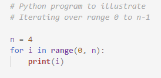
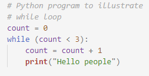
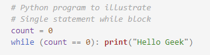
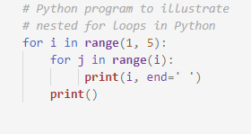
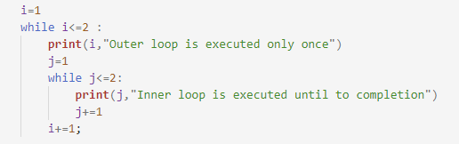

The execution of programming language codes is done by a compiler. A compiler is given a set of codes or rather a sequence of codes that perform a desired task. The task may or may not be repetitive but the compiler is smart enough to process it. Such repetitive code is known as a 'loop'. 

Loop is a sequential set of instructions which gets executed multiple times to reduce minimize the repetition of code. 
In Python, we have two types of loops : 
i. for loop 
ii. while loop 

To understand the functioning and flow of a loop, you must get familiar with the term 'block'. A block is the smallest unit in a loop which performs one particular task.  
<b>'For' loop :</b>  
Syntax :   for object in range(initialization, limit, update ): 
statements  
The above given syntax is of for loop where we put the object name after 'for' and the limit inside 'range( )'.  
Program: 
  
Output :  
0 
1 
2 
3  
<b>'While' loop :</b>  
Syntax :   while expression: 
statements  
The above statement is for while loop, where the testing condition is placed after while and it is followed by the statements placed in the loop body. 
Program:  
  
Output:  
Hello people 
Hello people 
Hello people  
Program:  
  
Output:  
hello geek 
hello geek 
..........  
Nested loops :  
A nested loop is an inner loop in the loop body of the outer loop. The inner or outer loop can be any type, such as a while loop or for loop. For example, the outer for loop can contain a while loop and vice versa  
Program:  
  
Output:  
1  
2 2 
3 3 3 
4 4 4 4  
Program:  
  
Output:  
1 Outer loop is executed only once 
1 Inner loop is executed until to completion 
2 Inner loop is executed until to completion 
2 Outer loop is executed only once 
1 Inner loop is executed until to completion 
2 Inner loop is executed until to completion

